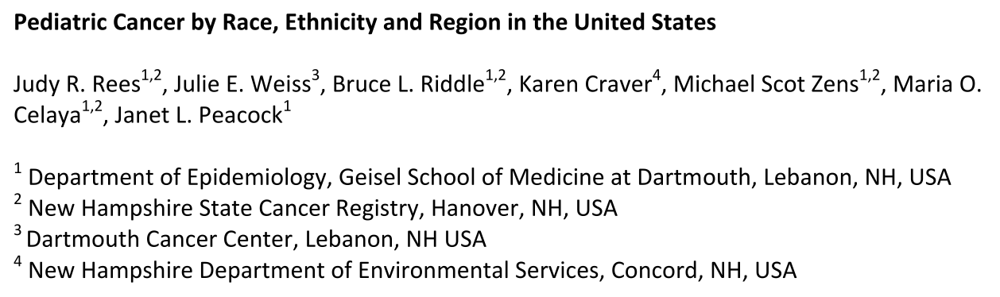
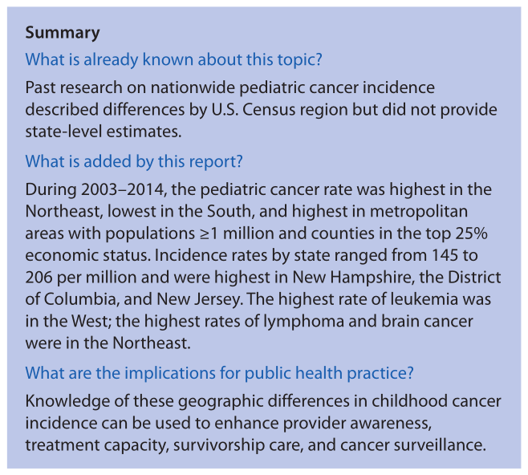
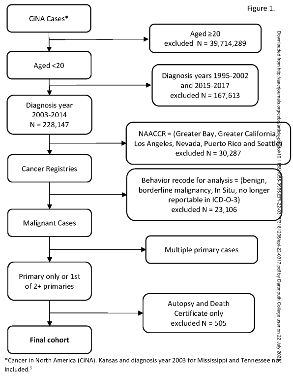

# Authors

# TL;DNR

> There was study done that indicated the northeast region of the US had the highest cancer incidence in children. The did a follow up to formally test this, and found it was true.

# Motivation & Relevant Parties

 - Siegel et al published a descriptive study on the incidence of cancer in children in the US (@siegelGeographicVariationPediatric2018).
 
 - "In a 2018 descriptive study, cancer incidence in children (age 0-19) in diagnosis years 2003-2014 was reported as being highest in New Hampshire and in the Northeast region" (@reesPediatricCancerRace).
 
 - The study was descriptive, and the authors set out to formalize the results to build on the findings.
 
 - Rees et al used "The Cancer in North America (CiNA) analytic file for researchers" to conduct formalized hypothesis testing of the ideas presented in Siegel et al.

# What is CiNA?

- The Cancer in North America (CiNA): "...cancer registries, governmental agencies, professional associations, and private groups in North America interested in enhancing the quality and use of cancer registry data." (@NAACCRNAACCR2016)

{height=75% width=75%}

# CiNA Sponsors

:::::: {.columns}
::: {.column width=100%}

:::
::::::

# The prequel: Overview of Siegel, et al.

 - These are CDC reports (@MorbidityMortalityWeekly2022)
 - What was their contribution?
 

{height=60%, width=60%}

From @siegelGeographicVariationPediatric2018
 

# The prequel: Overview of Siegel, et al cont'd

- Provided high-level overview with state-level stratification

- Built around Age-adjusted incidence of cancer among persons aged <20 years
    -   Used to adjust when comparing populations at different times.
    -   "Age adjustment, using the direct method, is the
application of observed age-specific rates to a standard age
distribution to eliminate differences in crude rates in
populations of interest that result from differences in the
populations’ age distributions. This adjustment is usually
done when comparing two or more populations at one point
in time or one population at two or more points in time." @kleinAgeAdjustmentUsing2001

# Overview of Rees, et al

:::::: {.columns}
::: {.column width=45%}

 - Start with CiNA Data.

 - Remove states with permission issues, low-quality data, smaller regions to avoid double counting.

 - Remove cases from autopsy or death certificates.
 
 - Calculate SE and CIs using Tiwari’s method that adjusts for the non-independence in regions @tiwariEfficientIntervalEstimation2006

:::

::: {.column width=55%}

{height=185, width=185}

From @reesPediatricCancerRace.

:::
::::::

# Technical notes on Rees, Tiwari 

  - Rees uses Bonferoni correction (@reesPediatricCancerRace)

  - Rees explains the non-independence as being "introduced by
the overlap between the whole group (e.g., Northeast region) and subgroup (e.g., New
Hampshire)." (@reesPediatricCancerRace).

  - Tiwari built on previous work (@fayConfidenceIntervalsDirectly1997) that assumed $\rho=0$ in the F-distribution it used, modifying the method to account for non-independence.

# Section 3

:::::: {.columns}
::: {.column width=35%}

:::

::: {.column width=65%}

:::
::::::

# References {.allowframebreaks}

