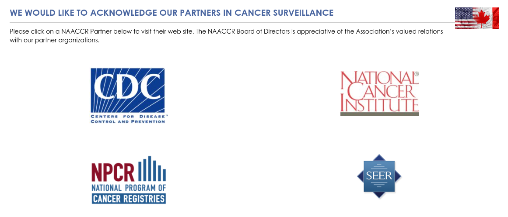
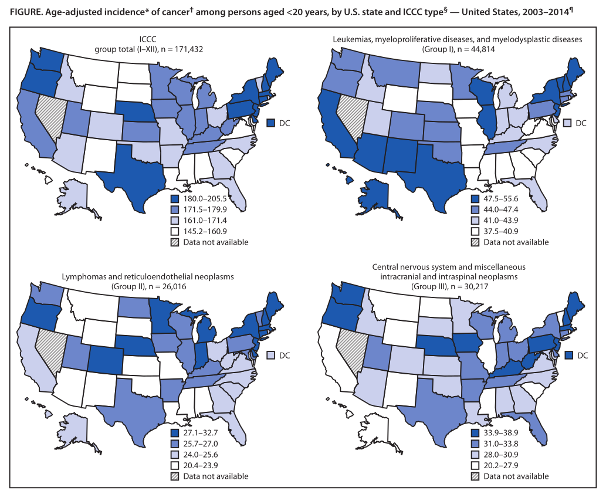

# Authors

# TL;DNR

> There was study done that indicated the northeast region of the US had the highest cancer incidence in children. The did a follow up to formally test this, and found it was true.

# Motivation & Relevant Parties

 - Siegel et al published a descriptive study on the incidence of cancer in children in the US (@siegelGeographicVariationPediatric2018).
 
 - "In a 2018 descriptive study, cancer incidence in children (age 0-19) in diagnosis years 2003-2014 was reported as being highest in New Hampshire and in the Northeast region" (@reesPediatricCancerRace).
 
 - The study was descriptive, and the authors set out to formalize the results to build on the findings.
 
 - Rees et al used "The Cancer in North America (CiNA) analytic file for researchers" to conduct formalized hypothesis testing of the ideas presented in Siegel et al.

# Background

## Siegel et al, CiNA, Tiwari, et al, etc.

# What is CiNA?

 The Cancer in North America (CiNA): "...cancer registries, governmental agencies, professional associations, and private groups in North America interested in enhancing the quality and use of cancer registry data." (@NAACCRNAACCR2016)
 
:::::: {.columns}
::: {.column width=15%}

:::
::: {.column width=85%}
{height=75% width=75%}

:::
::::::

# CiNA Sponsors

:::::: {.columns}
::: {.column width=100%}

:::
::::::

# The prequel: Overview of Siegel, et al.

  These are CDC reports (@MorbidityMortalityWeekly2022)

:::::: {.columns}
::: {.column width=15%}
:::
::: {.column width=85%}
{height=70%, width=70%}
:::
::::::

From @siegelGeographicVariationPediatric2018
 

# The prequel: Overview of Siegel, et al cont'd

- Provided high-level overview with state-level stratification

- Built around Age-adjusted incidence of cancer among persons aged <20 years
    -   Used to adjust when comparing populations at different times.
    -   "Age adjustment, using the direct method, is the application of observed age-specific rates to a standard age
distribution to eliminate differences in crude rates in populations of interest that result from differences in the
populations’ age distributions. This adjustment is usually done when comparing two or more populations at one point
in time or one population at two or more points in time." @kleinAgeAdjustmentUsing2001

# Let's go to the map...

:::::: {.columns}
::: {.column width=5%}
:::
::: {.column width=95%}
{height=85% width=85%}

@siegelGeographicVariationPediatric2018 | ICCC = International Classification of Childhood Cancer.
:::
::::::

# Rees et al

## The Main Event

# The "Northeast"?

:::::: {.columns}
::: {.column width=35%}
  - Connecticut
  - Maine
  - Massachusetts
  - New Hampshire
  - New Jersey
  - New York
  - Pennsylvania
  - Rhode Island
  - Vermont.
:::
::: {.column width=65%}

{height=90% width=90%}

@millerCartoonStockSearchResults2019

:::
::::::

# Overview of Rees, et al

:::::: {.columns}
::: {.column width=45%}

 - Start with CiNA Data.

 - Remove states with permission issues, low-quality data, smaller regions to avoid double counting.

 - Remove cases from autopsy or death certificates.
 
 - Calculate SE and CIs using Tiwari’s method that adjusts for the non-independence in regions @tiwariEfficientIntervalEstimation2006

:::

::: {.column width=55%}

{height=185, width=185}

From @reesPediatricCancerRace.

:::
::::::

# Technical notes

  - Rees uses Bonferoni correction (@reesPediatricCancerRace)

  - Rees explains the non-independence as being "introduced by
the overlap between the whole group (e.g., Northeast region) and subgroup (e.g., New
Hampshire)." (@reesPediatricCancerRace).

  - Tiwari built on previous work (@fayConfidenceIntervalsDirectly1997) that assumed $\rho=0$ in the F-distribution it used, modifying the method to account for non-independence.

# Finding of Rees, et al: Overall 1

 - "pediatric cancer incidence was significantly higher in the Northeast than other regions of the United States"
 - This finding held "overall and among non-Hispanic Whites and Blacks, but not among Hispanics and other racial minorities"
 - "there was no significant variability in incidence in the states within the Northeast overall or by race/ethnicity subgroup"
 - "Overall, statistically significantly higher incidence was seen in the Northeast for lymphomas, central nervous system neoplasms, and neuroblastoma."
 
All quotes: @reesPediatricCancerRace

# Findings of Rees, et al: Overall 2

:::::: {.columns}
::: {.column width=35%}

- Pediatric cancer incidence is significantly higher in the Northeast

- No significant variability in incidence within the Northeast region

:::
::: {.column width=65%}
{height=85% width=85%}
:::
::::::

# Discussion of Rees, et al: Socioeconomics 1

{height=95%, width=95%}
@mankoffBobMankoffCartoonStock2006

# Discussion of Rees, et al: Socioeconomics 2

 - Significant variations in race/ethnicity distribution across states make race adjustment crucial (NY vs NH).
 
 - Higher incidence of some cancers in the NE were not seen in the Hispanic population and Hispanic children have lower incidence of ALL and germ-line tumors than other places in the US.

 - Notes there is some inconsistency in the literature with regards to the last point, perhaps due to diversity of subgroups in the "Hispanic" category.
 
 - Notes that multiracial children are not captured by registries but birth-certificate studies have been done, suggesting they follow the risk of the minority parent.

@reesPediatricCancerRace

# Discussion of Rees, et al: Socioeconomics 3

 - Notes adult cancer is also higher in the Northeast.
 
 - Notes few pediatric cancer risk factors are known besides maternal age.
 
 - Notes higher socioeconomic status is a risk factor, Northeast is relatively affluent.
 
 - Suggests higher SES may be a proxy for maternal age (more education, etc).
 
 - Notes higher SES could lead to increased exposure to diagnostic testing (CT scans).
 
 - Also notes evidence NE children are less exposed to CTs.
 
 @reesPediatricCancerRace
 

# Summary 

 - Added statistical rigor to observed phenomena.
 
 - Confirmed significant increase in pediatric cancer in the NE.
 
 - Stratified and described patterns related to race for future study

# References {.allowframebreaks}

